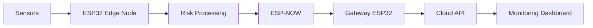
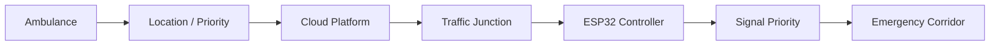
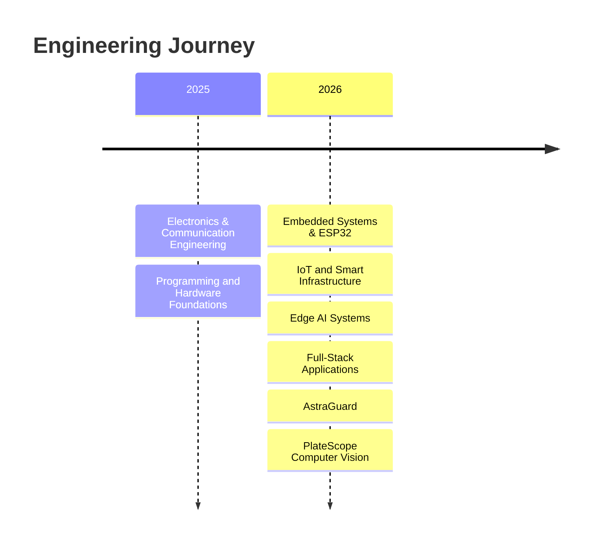

<div align="center">

# ⚡ VASANTH S

### ECE • COMPUTER VISION • EMBEDDED IoT • FULL-STACK

<p>
  <strong>Engineering intelligent systems across software, electronics and AI.</strong>
</p>

<br/>

[](https://svasanth2508.github.io/PORTFOLIO/)
[](https://github.com/svasanth2508)
[](https://www.linkedin.com/in/vasanth-sakthivel-05ba25396/)

<br/>


</div>

---

## `> whoami`

```yaml
Name: Vasanth S
Degree: B.E. Electronics & Communication Engineering
Institution: VSB Engineering College
Batch: 2025 - 2029

Engineering Focus:
  - Computer Vision
  - Artificial Intelligence
  - Embedded Systems
  - Internet of Things
  - Full-Stack Development
  - Real-Time Systems

Current Stack:
  - Python
  - YOLO
  - OpenCV
  - PaddleOCR
  - FastAPI
  - React
  - TypeScript
  - ESP32
```

---

## 🚀 Explore My Portfolio

<div align="center">

| 🌐 Portfolio                                                      | 💻 GitHub                                                                   | 🧠 Flagship Project                                                    |
| ----------------------------------------------------------------- | --------------------------------------------------------------------------- | ---------------------------------------------------------------------- |
| [**Open Portfolio ↗**](https://svasanth2508.github.io/PORTFOLIO/) | [**View Repositories ↗**](https://github.com/svasanth2508?tab=repositories) | [**Explore PlateScope ↗**](https://github.com/svasanth2508/PlateScope) |

</div>

---

# 🧠 Engineering Profile

I am an **Electronics and Communication Engineering undergraduate** building systems at the intersection of:

```text
ELECTRONICS
     │
     ├──────── Embedded Systems
     │
     ├──────── IoT / Telemetry
     │
     ▼
INTELLIGENT EDGE
     │
     ├──────── Computer Vision
     │
     ├──────── Machine Learning
     │
     ▼
SOFTWARE PLATFORM
     │
     ├──────── APIs
     │
     ├──────── Cloud
     │
     └──────── Modern Web Interfaces
```

My recent engineering work ranges from **video-based Automatic Number Plate Recognition** to **autonomous incident-resolution systems** and **ESP32 Edge-AI platforms**.

---

# ⭐ Featured Engineering Projects

## 01 — 🚘 PlateScope

> **AI-Powered Automatic Number Plate Recognition Platform**

[](https://github.com/svasanth2508/PlateScope)


PlateScope analyzes traffic videos and extracts unique vehicle registration numbers using a multi-stage computer-vision pipeline.

<details>
<summary><strong>🔍 Click to explore PlateScope</strong></summary>

<br/>

### What it does

* Accepts traffic-video uploads
* Samples video frames
* Detects license plates using YOLO
* Crops candidate plates
* Performs OCR using PaddleOCR
* Normalizes Indian registration numbers
* Supports conventional Indian and BH-series patterns
* Combines repeated observations across frames
* Displays OCR confidence and voting information
* Produces unique plate results
* Allows TXT export

### Technology

```text
Python
YOLO / Ultralytics
PaddleOCR
PaddlePaddle
OpenCV
PyTorch
FastAPI
React
TypeScript
Vite
```

### Pipeline


### Repository

➡️ **https://github.com/svasanth2508/PlateScope**

</details>

---

## 02 — 🛡️ AstraGuard

> **Autonomous Enterprise Incident Resolution Platform**

[](https://github.com/svasanth2508/AstraGuard)
[](https://astraguard-eight.vercel.app)

AstraGuard explores autonomous software operations by combining anomaly detection, dependency reasoning, remediation-risk evaluation and recovery verification.

<details>
<summary><strong>⚙️ Click to explore AstraGuard</strong></summary>

<br/>

### Core workflow

```text
Telemetry
   ↓
Anomaly Detection
   ↓
Root-Cause Analysis
   ↓
Dependency Reasoning
   ↓
Remediation Risk Assessment
   ↓
Low Risk ───────► Automatic Action

High Risk ──────► Human Approval
   ↓
Recovery Verification
   ↓
Incident Learning
```

### Engineering areas

* Python backend
* FastAPI
* Machine-learning based anomaly processing
* Dependency reasoning
* Risk-based remediation
* React frontend
* Cloud deployment

### Links

**Repository**

➡️ https://github.com/svasanth2508/AstraGuard

**Live Application**

➡️ https://astraguard-eight.vercel.app

</details>

---

## 03 — 📡 RESILIENT_AI_SIH

> **ESP32 Edge-AI Environmental Monitoring Platform**

[](https://github.com/svasanth2508/RESILIENT_AI_SIH)
[](https://resilient-ai-sih.vercel.app)

An embedded Edge-AI prototype combining ESP32 nodes, environmental sensors, edge processing, telemetry communication and cloud visualization.

<details>
<summary><strong>📡 Click to explore Edge-AI architecture</strong></summary>

<br/>



### Engineering areas

* ESP32
* Environmental sensors
* Edge processing
* ESP-NOW
* Telemetry
* Cloud APIs
* Dashboard visualization

### Links

**Repository**

➡️ https://github.com/svasanth2508/RESILIENT_AI_SIH

**Live Dashboard**

➡️ https://resilient-ai-sih.vercel.app

</details>

---

## 04 — 🚑 SECAPMS

> **Smart Emergency Corridor & Ambulance Priority Management System**

[](https://github.com/svasanth2508/secapms-project)
[](https://secapms-project.vercel.app)

SECAPMS explores intelligent traffic-priority coordination for emergency vehicles through embedded controllers, IoT communication and real-time monitoring.

<details>
<summary><strong>🚦 Click to explore SECAPMS</strong></summary>

<br/>

### Concept



### Technology areas

* ESP32
* Embedded control
* IoT
* Traffic priority
* Web dashboards
* Real-time monitoring
* Smart infrastructure

### Links

**Repository**

➡️ https://github.com/svasanth2508/secapms-project

**Live**

➡️ https://secapms-project.vercel.app

</details>

---

# 🧩 My Technology Stack

<details open>
<summary><strong>💻 Programming Languages</strong></summary>

<br/>


</details>

<details>
<summary><strong>🧠 AI & Computer Vision</strong></summary>

<br/>


</details>

<details>
<summary><strong>🌐 Full-Stack Development</strong></summary>

<br/>


</details>

<details>
<summary><strong>📟 Embedded Systems & IoT</strong></summary>

<br/>


</details>

<details>
<summary><strong>☁️ Cloud & Development</strong></summary>

<br/>


</details>

---

# 🏗️ Engineering Domains

<div align="center">

| 🧠 Intelligence  | 📟 Electronics  | 🌐 Software     |
| ---------------- | --------------- | --------------- |
| Computer Vision  | ESP32           | React           |
| Object Detection | Arduino         | FastAPI         |
| OCR              | Sensors         | TypeScript      |
| ML Inference     | IoT Telemetry   | REST APIs       |
| Video Analytics  | Edge Processing | Cloud Platforms |

</div>

---

# 🧭 Current Engineering Journey



---

# 📂 Featured Repositories

| Repository               | Domain                      | Access                                                      |
| ------------------------ | --------------------------- | ----------------------------------------------------------- |
| 🚘 **PlateScope**        | AI / Computer Vision / ANPR | [Open ↗](https://github.com/svasanth2508/PlateScope)        |
| 🛡️ **AstraGuard**       | Autonomous Software / ML    | [Open ↗](https://github.com/svasanth2508/AstraGuard)        |
| 📡 **RESILIENT_AI_SIH**  | Edge AI / ESP32 / IoT       | [Open ↗](https://github.com/svasanth2508/RESILIENT_AI_SIH)  |
| 🚑 **SECAPMS**           | Smart Infrastructure / IoT  | [Open ↗](https://github.com/svasanth2508/secapms-project)   |
| 🧠 **LeetCode Progress** | DSA / Problem Solving       | [Open ↗](https://github.com/svasanth2508/LeetCode-Progress) |

---

# 🎯 What I'm Building Toward

```text
                    INTELLIGENT SYSTEMS
                           │
          ┌────────────────┼────────────────┐
          │                │                │
    COMPUTER VISION    EMBEDDED AI      FULL-STACK
          │                │                │
       YOLO/OCR          ESP32           React
       OpenCV            Sensors         FastAPI
       Video AI          IoT             Cloud
          │                │                │
          └────────────────┼────────────────┘
                           │
                   REAL-WORLD SYSTEMS
```

My long-term engineering direction is to build reliable systems that combine:

> **Electronics + Intelligence + Software**

rather than treating them as isolated disciplines.

---

# 📖 Portfolio Features

<details>
<summary><strong>✨ Click to view portfolio features</strong></summary>

<br/>

The portfolio itself contains:

* Cyber/telemetry-inspired interface
* Interactive particle background
* Dark/light theme
* Animated section reveals
* Project filtering
* Interactive resume
* Engineering architecture modal
* GitHub project showcase
* Real-time HUD
* Responsive mobile design
* Contact interface

</details>

---

# ⚙️ Run This Portfolio Locally

<details>
<summary><strong>🛠️ Click for setup instructions</strong></summary>

<br/>

### Clone

```bash
git clone https://github.com/svasanth2508/PORTFOLIO.git
```

### Enter project

```bash
cd PORTFOLIO
```

### Install

```bash
npm install
```

### Run

```bash
npm start
```

Then open:

```text
http://localhost:3000
```

</details>

---

# 📬 Connect With Me

<div align="center">

[](mailto:svasanth2508@gmail.com)

[](https://www.linkedin.com/in/vasanth-sakthivel-05ba25396/)

[](https://github.com/svasanth2508)

[](https://svasanth2508.github.io/PORTFOLIO/)

</div>

---

<div align="center">

# ⚡ VASANTH S

### Electronics × Intelligence × Software

> **Building systems that see, analyze and respond.**

<br/>


<br/>

⭐ **Explore the projects • Inspect the architecture • Follow the engineering journey**

<br/>

© 2026 Vasanth S

</div>
